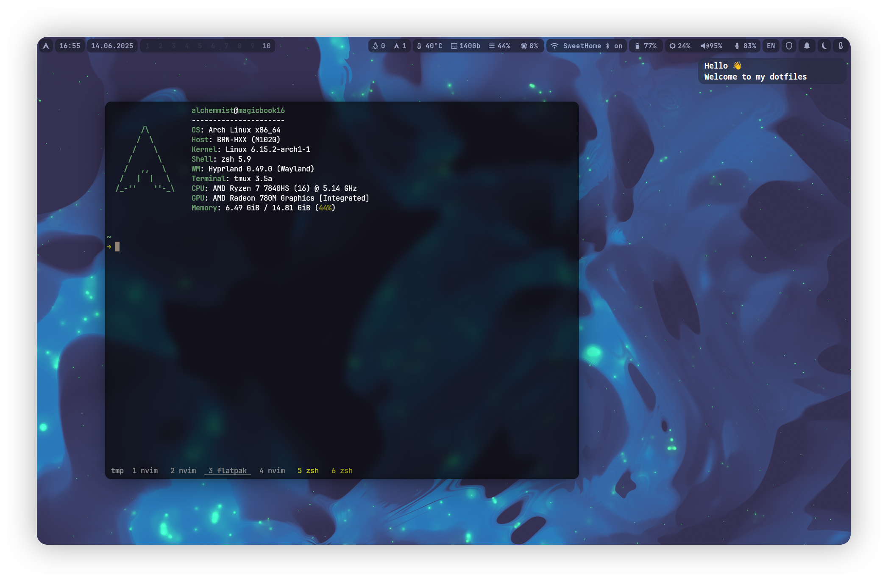

<h2>alchemical dotfiels</h2>

    

### Contents
What you can fine in this repo?

- [shell](https://github.com/alchemmist/dotfiles/blob/main/zsh) -- `zsh` with `oh-my-zsh` plugin and some custom stafe.
- [wallpapers](https://github.com/alchemmist/dotfiles/blob/main/wallpapers) -- Here you can find all my wallpapers packs and some scripts for great working with it.

